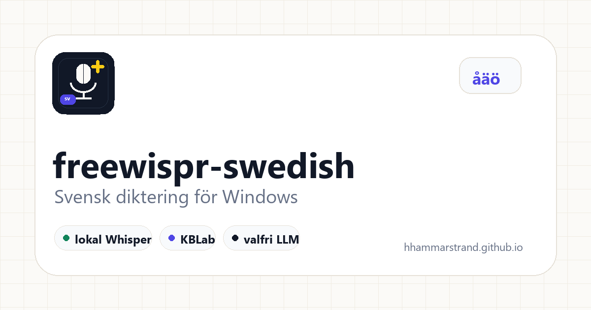

# freewispr-swedish

**Svensk diktering för Windows.** Håll en tangent, prata och få texten där markören redan står.

[](https://github.com/hhammarstrand/freewispr-swedish/actions/workflows/build-windows.yml)
[](https://hhammarstrand.github.io/freewispr-swedish/)



freewispr-swedish är en svensk fork av [x26prakhar/freewispr](https://github.com/x26prakhar/freewispr), anpassad för svensk Whisper-diktering, Windows-arbetsflöden och terminaler där vanlig automatisk paste ofta fallerar.

## Vad som är annorlunda

- **Svenska KBLab-modeller** via `faster-whisper`, med `KBLab/kb-whisper-small` som standard.
- **Lokal först**: ljud och transkribering sker på datorn när LLM-granskning är avstängd.
- **Clipboard-fallback**: dikterad text lämnas kvar i urklipp, så den går att klistra in manuellt även i terminaler och CLI-verktyg.
- **Valfri LLM-granskning** via GitHub Models/Azure efter lokal Whisper-transkribering. Text skickas bara när du aktiverar funktionen.
- **Tydlig status**: indikatorn visar om appen transkriberar lokalt, LLM-granskar eller har klistrat in lokal/LLM-granskad text.
- **Musföljande indikator**: lyssnarrutan kan följa muspekaren över flera skärmar eller ligga fast på huvudskärmen.
- **Personlig ordlista, hotwords och snippets** för namn, facktermer och återkommande text.
- **Automatiska Windows-buildar** via GitHub Actions.

## Snabbstart

### Ladda ner senaste build

Det finns ännu ingen stabil release. Använd senaste GitHub Actions-build tills versionerna stabiliseras:

1. Öppna [Build Windows EXE](https://github.com/hhammarstrand/freewispr-swedish/actions/workflows/build-windows.yml).
2. Välj senaste lyckade körningen på `master`.
3. Ladda ner artifact `freewispr-swedish-windows`.
4. Packa upp zip-filen och kör `freewispr-swedish.exe`.
5. Håll `Ctrl+Space`, prata och släpp för att klistra in texten.

Artifacts på GitHub kan kräva att du är inloggad och sparas normalt bara en begränsad tid.

### Kör från källkod

Krav: Windows 10/11 och Python 3.10+.

```bash
git clone https://github.com/hhammarstrand/freewispr-swedish.git
cd freewispr-swedish
pip install -r requirements.txt
python main.py
```

Valfri CUDA-installation för NVIDIA GPU:

```bash
pip install torch --index-url https://download.pytorch.org/whl/cu124
```

## Integritet

Standardläget skickar inte ljud eller transkriberad text till en LLM.

Appen kan använda nätverk i dessa fall:

- Första modellstarten laddar ner vald KBLab-modell från Hugging Face om den saknas lokalt.
- LLM-granskning är avstängd som standard. Om du aktiverar den skickas transkriberad text, inte ljud, till GitHub Models/Azure.
- GitHub-token för LLM kan hämtas från sparad nyckel, `GITHUB_TOKEN`, `GH_TOKEN` eller `gh auth token` och skrivs inte ut i loggar.

Dikterad text lämnas avsiktligt kvar i urklipp efter pasteförsök. Det gör appen mer robust i terminaler, opencode/CLI och andra miljöer som blockerar syntetisk paste.

## Funktioner

- Push-to-talk med valfri snabbtangent, standard `Ctrl+Space`.
- Systemfacksapp med inställningar för mikrofon, modell, CUDA och autostart.
- WASAPI/DirectSound/MME med automatisk prioritering.
- Flerkanalig ljudhantering och resampling till 16 kHz för Whisper.
- Tystnadsdetektion som avvisar för tysta inspelningar.
- Personliga korrigeringar för ord som ofta hörs fel.
- Hotwords från ordlista och `~/.freewispr-swedish/hotwords.txt`.
- Snippets/textmallar.
- LLM-status: lokal, LLM-granskad eller LLM-polerad.
- Ny projektspecifik ikon, favicon och social preview.

## Modeller

freewispr-swedish använder [KBLab:s Whisper-modeller](https://huggingface.co/KBLab), tränade på svenskt tal.

| Modell | Storlek | Kommentar |
|--------|---------|-----------|
| `tiny` | cirka 40 MB | Snabbast, lägre precision |
| `base` | cirka 150 MB | Liten och snabb |
| `small` | cirka 500 MB | Standard och bästa balans för de flesta |
| `medium` | cirka 1.5 GB | Bättre precision, tyngre |
| `large` | cirka 3 GB | Tyngst, kan kräva konvertering |

Modeller sparas i `~/.freewispr-swedish/models/` och laddas ner automatiskt vid första användning.

Medium- och large-modeller kan behöva konverteras till CTranslate2-format:

```bash
pip install ctranslate2 transformers
python convert_model.py medium
python convert_model.py large
```

## Inställningar

Högerklicka på systemfacksikonen och välj **Inställningar**.

| Inställning | Beskrivning |
|-------------|-------------|
| Snabbtangent | Tangentkombination för diktering |
| Mikrofon | Specifik mikrofon eller auto |
| Modell | `tiny`, `base`, `small`, `medium` eller `large` |
| GPU/CUDA | Använd NVIDIA GPU när tillgänglig |
| Lyssnarindikator | Följ muspekaren eller visa fast på huvudskärmen |
| LLM-granskning | Valfri eftergranskning av transkriberad text |

Konfiguration sparas i `~/.freewispr-swedish/config.json`. LLM API-nyckel sparas i Windows Credential Manager via `keyring`, inte i config-filen.

Exempel:

```json
{
  "hotkey": "ctrl+space",
  "model_size": "small",
  "use_cuda": true,
  "mic_device": null,
  "indicator_follow_mouse": true,
  "llm_enabled": false,
  "llm_model": "openai/gpt-4.1-nano"
}
```

## Datafiler

| Fil | Beskrivning |
|-----|-------------|
| `~/.freewispr-swedish/corrections.json` | Personliga ordkorrigeringar |
| `~/.freewispr-swedish/snippets.json` | Snippets och expansioner |
| `~/.freewispr-swedish/hotwords.txt` | Egna termer för Whisper |
| `~/.freewispr-swedish/freewispr.log` | Logg för felsökning |
| `~/.freewispr-swedish/models/` | Nedladdade och konverterade modeller |

## Bygga exe

```bash
build.bat
```

Bygget skapar `dist/freewispr-swedish/freewispr-swedish.exe` med PyInstaller.

Ikoner och webbassets genereras med:

```bash
python make_icon.py
```

## Testa

```bash
python -m pytest tests/ -q
```

## Projektstruktur

```text
freewispr-swedish/
+-- main.py          # systemfack, inställningar, applifecycle
+-- dictation.py     # push-to-talk, pipeline och paste-status
+-- transcriber.py   # KBLab Whisper, CUDA och LLM-granskning
+-- audio.py         # mikrofoninspelning, resampling och kanalhantering
+-- paste.py         # urklipp och terminalvänlig paste
+-- ui.py            # Tkinter UI och flytande indikator
+-- config.py        # config och nyckelhantering
+-- corrections.py   # personlig ordlista
+-- snippets.py      # snippets/textmallar
+-- llm_polish.py    # GitHub Models-integration
+-- make_icon.py     # genererar appikon, favicon och OG-bild
+-- docs/            # GitHub Pages-site
```

## Uppdatera från originalet

```bash
git remote add upstream https://github.com/x26prakhar/freewispr.git
git fetch upstream
git merge upstream/master
```

## Licens

[MIT](LICENSE)

## Tack till

- [KBLab](https://huggingface.co/KBLab) för svenska Whisper-modeller.
- [faster-whisper](https://github.com/SYSTRAN/faster-whisper) för effektiv Whisper-inferens via CTranslate2.
- [OpenAI Whisper](https://github.com/openai/whisper) för den ursprungliga modellen.
- [freewispr](https://github.com/x26prakhar/freewispr) för originalprojektet.
